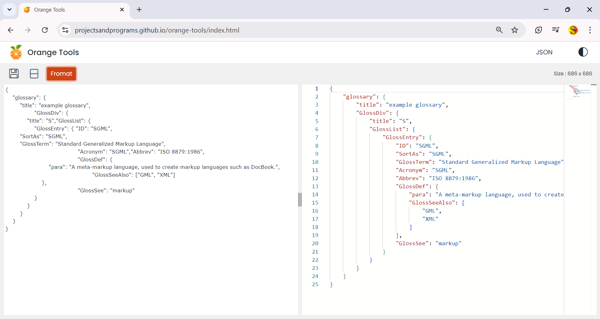
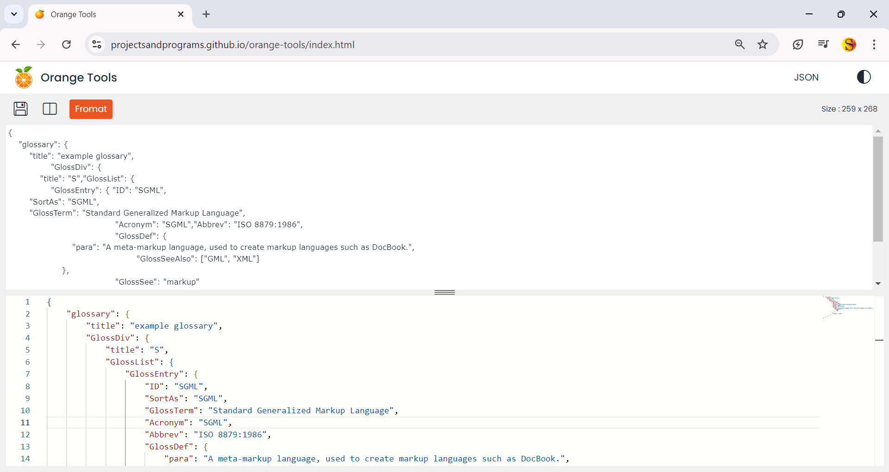
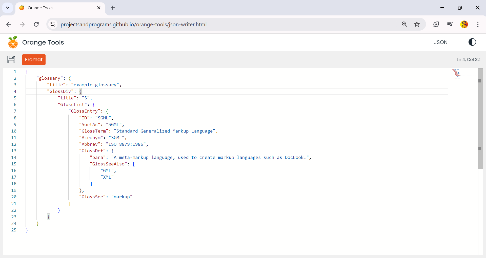
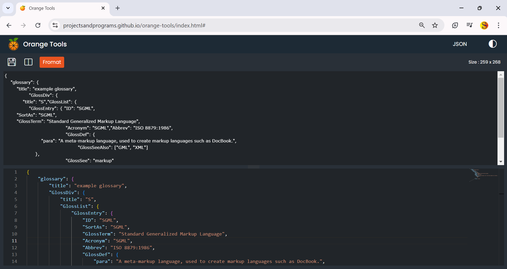

# orange-tools
An tool application created for quick use when needed, [Click here to view a live demo](https://projectsandprograms.github.io/orange-tools/index.html)

## 🥏 Technolgies Used 
  1. HTML, CSS 
  2. Bootstrap 5
  3. JQuery, JavaScript

# Images

   

        
        
    

     

        
        
    

 

## ❤️ Contributing

Pull requests are welcome. For major changes, please open an issue first
to discuss what you would like to change.

Please make sure to update tests as appropriate.

